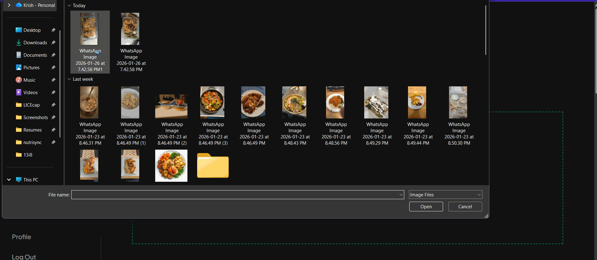
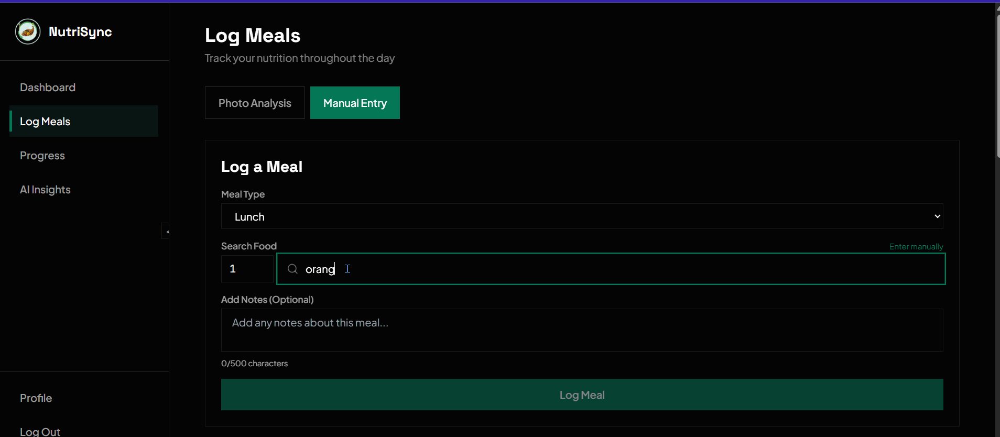
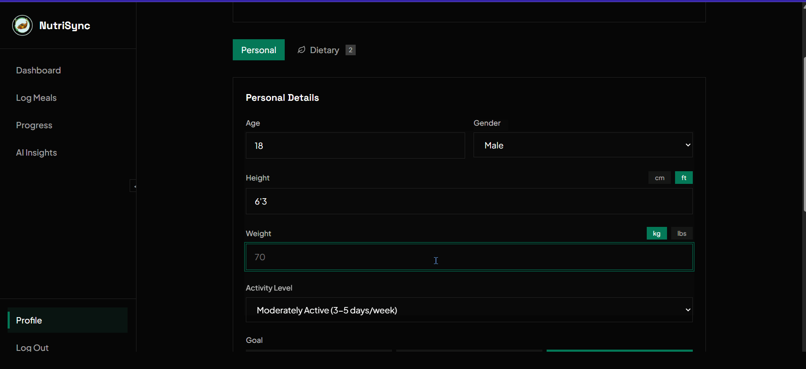
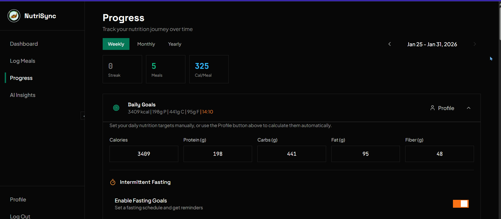
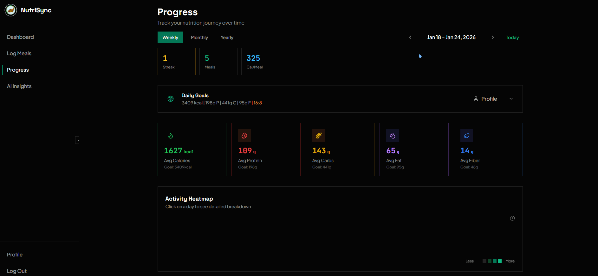
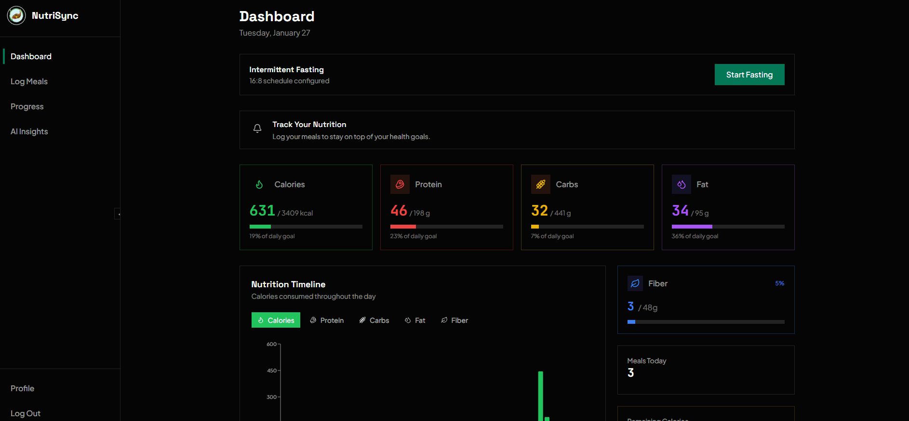
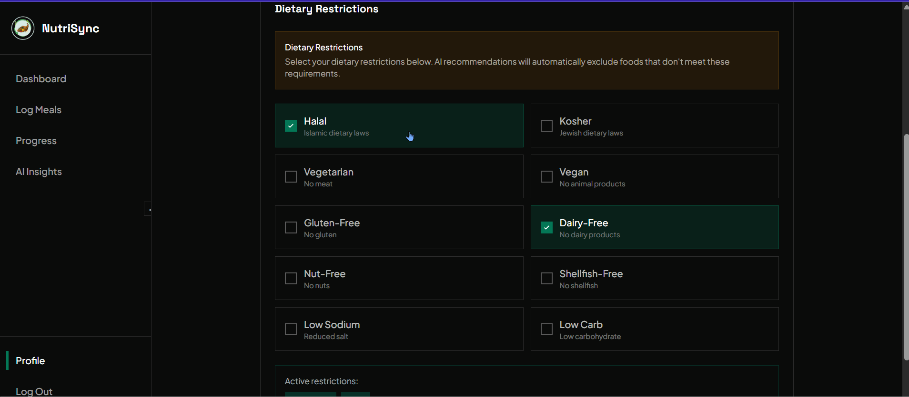

# NutriSync

[](https://nutrisync.me)
[](https://github.com/KrishP147/nutrisync/actions/workflows/ci.yml)
[](https://codecov.io/gh/KrishP147/nutrisync)
[](https://opensource.org/licenses/MIT)
[](https://supabase.com/docs/guides/functions)
[](https://nodejs.org/)

NutriSync is a comprehensive full-stack nutrition tracking application designed to simplify and enhance the way users manage their dietary health. The platform combines intelligent meal logging with AI-powered food recognition, personalized nutrition tracking, and intermittent fasting support to create an all-in-one health management solution.

Users can effortlessly log meals by uploading food photos for instant AI analysis or searching through a database of over 400,000 foods from the USDA FoodData Central. The application calculates personalized calorie and macro targets based on individual body metrics, activity levels, and fitness goals (weight loss, maintenance, or muscle gain) using industry-standard BMR and TDEE formulas. Progress is tracked through interactive visualizations, daily nutrition reports, and streak-based achievements to encourage consistent logging habits.

For users practicing intermittent fasting, NutriSync offers built-in fasting timers with support for popular schedules including 16:8, 18:6, 20:4, and OMAD, complete with real-time progress tracking and hydration reminders. The platform also respects dietary preferences and restrictions (Halal, Kosher, Vegan, Vegetarian, Gluten-Free, Dairy-Free, Nut-Free, and more) by flagging incompatible foods during meal logging.

## Features

**Core Functionality**
- **AI food recognition** via photo upload (Google Gemini AI)

  

- **Comprehensive food database search** (USDA FoodData Central - 400,000+ foods)

  

- **Customizable nutrition goals** with BMR/TDEE calculations

  

- **Intermittent fasting tracking** (16:8, 18:6, 20:4, OMAD schedules)

  

- **Progress visualization** with interactive charts

  

- **Personalized daily reports**, saved across each logging day

  

- **Dietary restriction support** (Halal, Kosher, Vegan, Vegetarian, Gluten-Free, etc.)

  

## Technical Features

- Google OAuth authentication with email/password fallback
- Email infrastructure with Resend SMTP (custom domain with SPF/DKIM/DMARC compliance)
- Password reset, email change verification, and secure account deletion workflows
- Row Level Security (RLS) policies ensuring complete data privacy
- Real-time meal photo storage with Supabase Storage
- AI nutrition assistant chatbot for dietary guidance
- Responsive design with dark mode theming
- Comprehensive testing suite with coverage tracking via Codecov flags
- CI/CD pipeline with GitHub Actions

## Demo

https://github.com/user-attachments/assets/f1217762-c269-4474-9f93-19e1be9ed174

## Tech Stack

**Frontend**: React 18, Vite, Tailwind CSS, Plotly.js, Supabase Client

**Backend**: Supabase Edge Functions (Deno/TypeScript), Google Gemini AI, USDA API

**Infrastructure**: Supabase (PostgreSQL + Auth + Storage + Edge Functions), Vercel (Frontend), GitHub Actions (CI/CD)

## Documentation

Complete setup instructions: **[docs/README.md](docs/README.md)**

### Quick Links

1. [Prerequisites](docs/01-prerequisites.md) - Required software and accounts
2. [Database Setup](docs/02-database-setup.md) - Supabase and migrations
3. [API Configuration](docs/03-api-configuration.md) - External APIs
4. [Running Locally](docs/04-running-locally.md) - Development setup
5. [Google OAuth](docs/05-google-oauth.md) - Optional OAuth setup
6. [Testing](docs/06-testing.md) - Running tests
7. [Deployment](docs/07-deployment.md) - Production deployment
8. [Troubleshooting](docs/08-troubleshooting.md) - Common issues and solutions

## Quick Start

### Install Dependencies

Backend (Supabase CLI, for Edge Functions):
```bash
# https://supabase.com/docs/guides/cli/getting-started
supabase functions serve
```

Frontend:
```bash
cd frontend
npm install
```

### Configure Environment

Set Edge Function secrets (once, via Supabase CLI - `SUPABASE_URL` and
`SUPABASE_SERVICE_ROLE_KEY` are injected automatically, you don't set them):
```bash
supabase secrets set GOOGLE_API_KEY=your_gemini_api_key
supabase secrets set USDA_API_KEY=your_usda_key
```

Create `frontend/.env.local`:
```env
VITE_SUPABASE_URL=your_supabase_url
VITE_SUPABASE_ANON_KEY=your_anon_key
VITE_API_URL=http://localhost:54321/functions/v1
```

### Run Application

Backend (Edge Functions, local emulator):
```bash
supabase functions serve
```

Frontend:
```bash
cd frontend
npm run dev
```

Access at `http://localhost:5173`

## Project Structure

```
nutrisync/
├── supabase/
│   ├── functions/       # Edge Functions - API routes (12 endpoints)
│   │   ├── _shared/     # Shared CORS, Gemini REST client, helpers
│   │   └── <name>/index.ts
│   └── config.toml
├── backend/              # Historical DB migrations only (no app code)
│   └── migrations/       # Database migrations (8 files)
├── frontend/            # React application
│   ├── src/
│   │   ├── components/  # React components
│   │   ├── pages/       # Page routes
│   │   └── services/    # API clients
│   └── tests/           # Frontend tests (137 tests, 60.4% coverage)
├── docs/                # Setup documentation
└── .github/workflows/   # CI/CD configuration
```

## Testing
Frontend:
```bash
cd frontend
npm test                  # Run all tests
npm run test:coverage    # With coverage report
```

**Test Organization**:
- Frontend: (contexts, components, pages, charts)
- Backend: no automated tests currently (the old FastAPI pytest suite was retired along with the FastAPI app; Edge Functions would use `deno test`)

**CI/CD**: Automated testing on every push via GitHub Actions

## Deployment

**Backend**: Supabase Edge Functions via `supabase functions deploy`

**Frontend**: Vercel with automatic GitHub integration

See [Deployment Guide](docs/07-deployment.md) for detailed instructions.

## License

MIT License - see [LICENSE](LICENSE) file

## Contributing

1. Fork the repository
2. Create a feature branch (`git checkout -b feature/name`)
3. Commit changes (`git commit -m 'Add feature'`)
4. Push to branch (`git push origin feature/name`)
5. Open a Pull Request

Run tests before submitting:
- Frontend: `npm test`

---

**Note**: This monorepo combines frontend and backend. Original separate repositories ([frontend](https://github.com/KrishP147/nutrisync-frontend), [backend](https://github.com/KrishP147/nutrisync-backend)) are archived.
